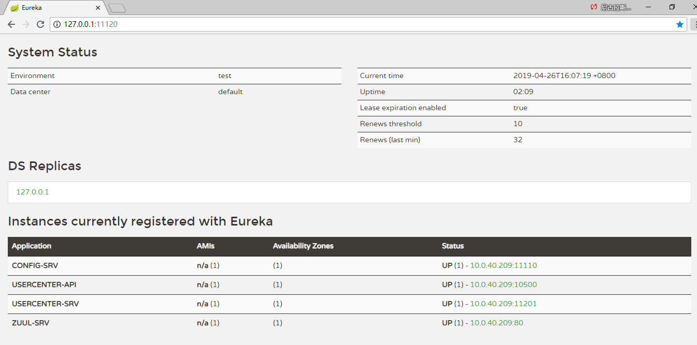

V1.0 中加入了tx-lcn分布式事务解决方案 

项目目录结构

1. 基础项目 micro-base
 + micro-base-entity  公共实体、工具类
 + micro-eureka-server 服务注册发现中心
 + micro-config-server 集中配置中心
 + micro-zuul 网关 
 
2. 模拟业务系统服务 —— 用户中心服务 — micro-usercenter
 + micro-usercenter-entity: 本项目实体
 + micro-usercenter-service：本项目Service服务
 + micro-usercenter-service-api：本项目feignClient[声明式客户端]
 + micro-usercenter-web-api：本项目Web服务[提供给前端团队API] 
   
 
## 启动顺序
### 1. 启动 eureka-server 
### 2. 启动 config-server
### 3. 启动 zuul
### 4. 启动 usercenter-srv 
### 5. 启动 usercenter-api 
 
访问eureka界面，http://127.0.0.1:11120/，显示如下，证明服务均正常启动
 
 